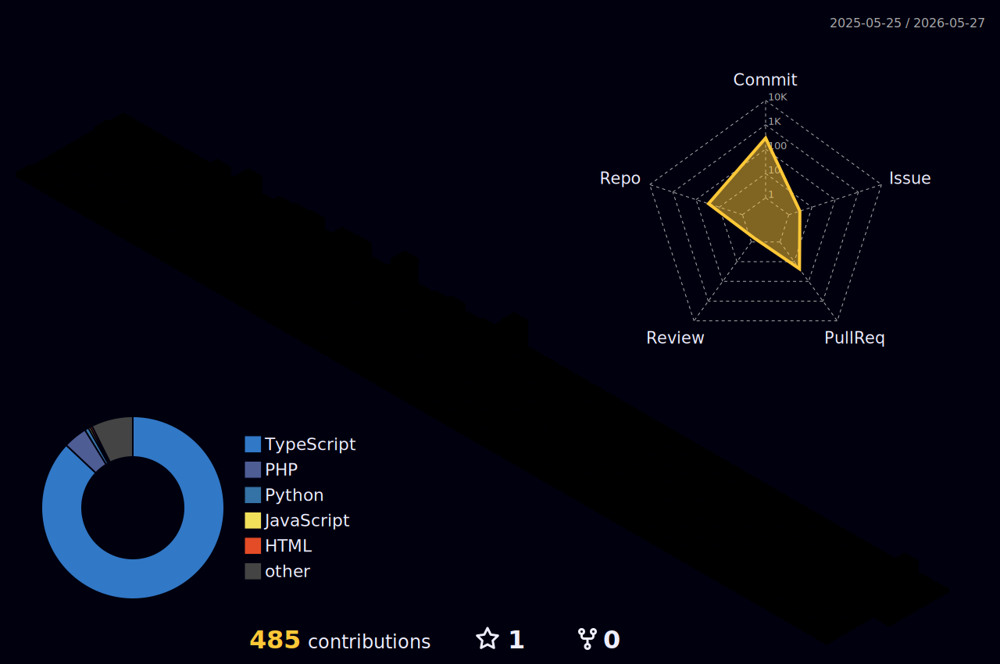

<h1>Hi there, I'm Soshie Anthony Finney </h1>

<h2>About Me</h3>

I'm a self-taught developer currently focused on building modern web applications.

<h2>Statistics</h3>

<h2>Activity</h2>

<picture>
  <source media="(prefers-color-scheme: dark)" srcset="https://raw.githubusercontent.com/AnthonyFinney/AnthonyFinney/output/github-contribution-grid-snake-dark.svg">
  <source media="(prefers-color-scheme: light)" srcset="https://raw.githubusercontent.com/AnthonyFinney/AnthonyFinney/output/github-contribution-grid-snake.svg">
  
</picture>

<!-- 
<h2>My Contribution And Most Used Languages</h3>

 -->

<h2>My Holopin badges</h3>

